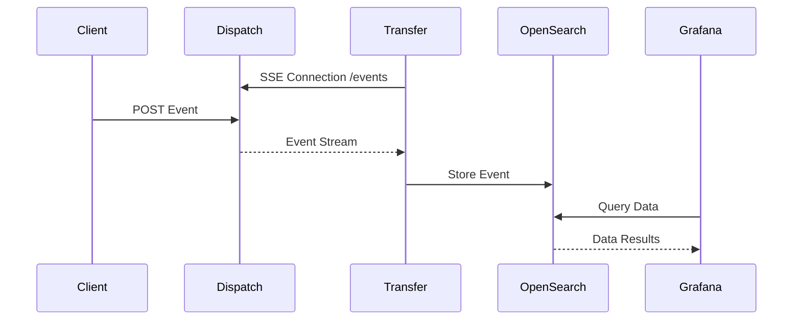

# Pillarbox Monitoring Infrastructure


The Pillarbox Monitoring Infrastructure manages the Dispatch and Transfer services, using Terraform
for cloud deployment and Docker Compose for local development and testing.

This project enables real-time event streaming, storage, and visualization, offering a complete
monitoring solution for the Pillarbox player.

## Quick Guide

**Prerequisites and Requirements**

- **Terraform** 1.0 or higher
- **Docker** and **Docker Compose**

### Setup

1. **Clone the Repository**

   Clone the repository and initialize the submodules:

   ```bash
   git clone --recurse-submodules git@github.com:SRGSSR/pillarbox-monitoring-infra.git
   ```

   If you have already cloned the repository without submodules, initialize them with:

   ```bash
   git submodule update --init --recursive
   ```

### Executing Terraform Scripts

Before running the Terraform scripts, ensure your environment is correctly configured.

1. **AWS Region and Profiles**

   Set the `AWS_REGION` and `AWS_PROFILE` environment variables:

   ```bash
   export AWS_REGION=<your-region>
   export AWS_PROFILE=<workspace>
   ```

   - Replace `<your-region>` with your desired AWS region (e.g., `us-east-1`).
   - Replace `<workspace>` with either `dev` or `prod`, matching the Terraform workspace you intend
     to use.

   **Note:** You must have AWS CLI profiles named `dev` and `prod` configured in your
   `~/.aws/credentials` or `~/.aws/config` files. Each profile should correspond to the AWS account
   for the respective environment.

2. **Terraform Workspaces**

   The project utilizes two Terraform workspaces: `dev` and `prod`, corresponding to development and
   production environments. Switch between workspaces using:

   ```bash
   terraform workspace select dev   # Switch to the development environment
   terraform workspace select prod  # Switch to the production environment
   ```

   See the [Documentation](#documentation) for more information on which workspace to use for each
   configuration.

3. **Running Terraform**

   Initialize the Terraform working directory and apply the configuration:

   ```bash
   terraform init
   terraform apply
   ```

   Review the execution plan carefully before confirming the changes.

### Running Locally with Docker Compose

This repository allows running the Pillarbox Monitoring solution locally. To do so first start
services using Docker Compose:

```bash
docker-compose up --build
```

This command will build and run the following services:

- **pillarbox-event-dispatcher**: Receives events via HTTP POST and broadcasts them via SSE.
- **pillarbox-monitoring-transfer**: Listens to SSE events and stores them in OpenSearch.
- **OpenSearch**: Stores the events for analysis.
- **Grafana**: Visualizes the data stored in OpenSearch.

**Sending Events**: You can send events to the system using the following command:

 ```bash
 curl -X POST http://localhost:8080/api/events \
      -H 'Content-Type: application/json' \
      -d "{\"msg\": \"data\", \"timestamp\": \"$(date +%s)\"}"
 ```

**Accessing Grafana**: Grafana is accessible at [http://localhost:3000](http://localhost:3000).

## Documentation

The project is split into four main Terraform configurations:

- [01-terraform-backend][terraform-backend]: This configuration sets up the Terraform backend and is
  **only applicable in the prod environment**. The backend is used to store Terraform state
  remotely, ensuring that multiple users and systems can work on infrastructure collaboratively.
- [10-pillarbox-monitoring-route-53][route-53]: This handles the creation of the Route 53 DNS setup
  for the project. **This is only executed in the prod environment**, as Route 53 is linked to the
  production domain.
- [11-pillarbox-monitoring-ecr][ecr]: This configuration sets up the Amazon Elastic Container
  Registry (ECR). **This is only applicable to the prod environment**, as the ECR repositories for
  the application are managed in the production account.
- [20-pillarbox-monitoring-app][app]: This is the main configuration that deploys the Pillarbox
  Monitoring infrastructure. **This applies to both dev and prod environments**. You can switch
  between workspaces (as mentioned earlier) to deploy infrastructure in either the dev or prod
  account.
- [21-continuous-delivery][cd]: This configuration contains the definition of the IAM roles that
  allow access to GitHub Action for specific repositories and operations. **This applies to both
  dev and prod environments**. You can switch between workspaces (as mentioned earlier) to deploy
  infrastructure in either the dev or prod account.

### System Flow Overview

The system architecture is illustrated in the following sequence diagram:



## Contributing

Contributions are welcome! Please follow the project's code style and linting rules when
contributing.

To ensure consistent formatting for Terraform files, run:

```bash
terraform fmt -recursive pillarbox-monitoring-terraform
```

All commits must follow the [Conventional Commits](https://www.conventionalcommits.org/en/v1.0.0/)
format to ensure compatibility with our automated release system.

A pre-commit hook is available to validate commit messages and the formatting. Update the Git hooks
path to automate these checks before committing and pushing your changes:

```bash
git config core.hooksPath .githooks/
```

Refer to our [Contribution Guide](docs/CONTRIBUTING.md) for more detailed information.

### Exporting Dashboards from production

See the [Grafana Dashboard Export Guide](./docs/DASHBOARD_EXPORT_GUIDE.md) for information on how
to export and backup the dashboards in production.

## License

This project is licensed under the [MIT License](LICENSE).

[terraform-backend]: /pillarbox-monitoring-terraform/01-terraform-backend
[route-53]: /pillarbox-monitoring-terraform/10-pillarbox-monitoring-route-53
[ecr]: /pillarbox-monitoring-terraform/11-pillarbox-monitoring-ecr
[app]: /pillarbox-monitoring-terraform/20-pillarbox-monitoring-app
[cd]: /pillarbox-monitoring-terraform/21-continuous-delivery
